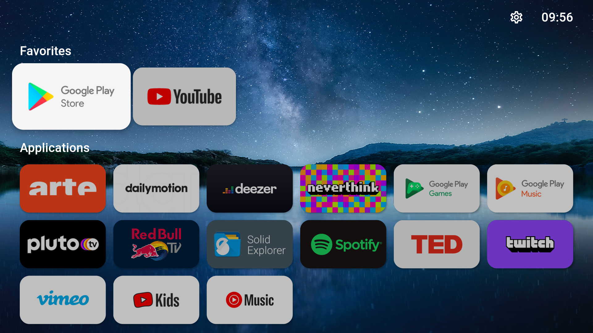
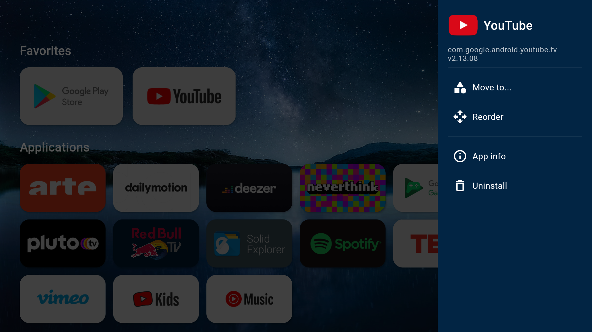
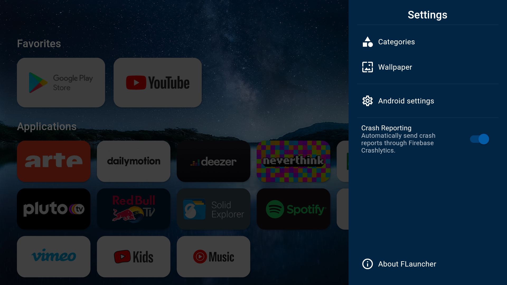

# FLauncher Locked

This fork adds a password-protected kiosk mode to FLauncher. Applications on the home screen remain directly
launchable, while settings, empty-category editing, long-press actions, reordering, hiding and uninstall shortcuts
require authentication. On first access to a protected action, the administrator creates a password of at least four
characters. The password is stored only as a salted SHA-256 digest in Android's application preferences.
Individual applications can also be marked as launch-protected from their long-press administration panel; selecting
one of those applications then requires the same administrator password.
Any successful authentication enables an in-memory administrator mode for up to four hours. It unlocks protected apps
and launcher administration consistently. The home-screen administrator tile shows the current mode and can return to
restricted mode immediately. The session is cleared earlier whenever the launcher process or Shield is restarted and
is never persisted to storage.
Initial setup also requires four recovery answers. They are normalized and stored only as salted hashes; matching at
least three of the four answers permits choosing a new administrator password.
The recovery action is hidden until ten failed password attempts and the failure counter survives closing the dialog
during the current launcher process. A successful login or reset clears it.
Recovery comparison is case-, whitespace- and accent-insensitive. Common birth-date formats with two- or four-digit
years are canonicalized, and the first-car field corrects common make spellings such as `citroen` to `Citroën` in both
setup and recovery.

The protected settings also contain an HTTPS APK downloader. It saves the package in private cache storage and hands
it to Android's standard package installer through a read-only `FileProvider`. Android still requires the administrator
to grant the app-specific "install unknown apps" permission and performs its normal signature and security checks.

A password-protected, read-only usage dashboard can display foreground time per application and day for the previous
seven days. It uses Android's explicit Usage Access permission and keeps all statistics locally on the TV.
On Android 9 and newer, screen-interactive events are intersected with foreground-app events so standby and
non-interactive display time are excluded. Older Android versions use the platform's foreground-time aggregate.

> This is an application-level launcher lock, not Android Lock Task mode. System settings, notifications, alternate
> launchers and hardware/vendor shortcuts must be restricted separately with Android Device Owner management if a
> fully managed kiosk is required.

## Building

This historical codebase targets Flutter 2.5.1. Install that Flutter version, then run `flutter pub get` and
`flutter build apk --release`.

## Upstream
FLauncher is an open-source alternative launcher for Android TV, built with [Flutter](https://flutter.dev).

The project is still at an early development stage and may be unstable. It currently lacks testing on real devices and has only been tested on Chromecast with Google TV.

<a href="https://play.google.com/store/apps/details?id=me.efesser.flauncher">
 
</a>

## Features
- [x] No ads
- [x] Customizable categories
- [x] Manually reorder apps within categories
- [x] Wallpaper support
- [x] Open "Android Settings"
- [x] Open "App info"
- [x] Uninstall app
- [x] Clock
- [x] Switch between row and grid for categories
- [x] Support for non-TV (sideloaded) apps
- [x] Navigation sound feedback
- [ ] Force stop app

## Screenshots
|  |  |  |
|--|--|--|
|  |  |  |

## Set FLauncher as default launcher

### Method 1: remap the Home button
This is the "safer" and easiest way. Use [Button Mapper](https://play.google.com/store/apps/details?id=flar2.homebutton) to remap the Home button of the remote to launch FLauncher.

### Method 2: disable the default launcher
**:warning: Disclaimer :warning:**

**You are doing this at your own risk, and you'll be responsible in any case of malfunction on your device.**

The following commands have been tested on Chromecast with Google TV only. This may be different on other devices.

Once the default launcher is disabled, press the Home button on the remote, and you'll be prompted by the system to choose which app to set as default.

#### Disable default launcher
```shell
# Disable com.google.android.apps.tv.launcherx which is the default launcher on CCwGTV
$ adb shell pm disable-user --user 0 com.google.android.apps.tv.launcherx
# com.google.android.tungsten.setupwraith will then be used as a 'fallback' and will automatically
# re-enable the default launcher, so disable it as well
$ adb shell pm disable-user --user 0 com.google.android.tungsten.setupwraith
```

#### Re-enable default launcher
```shell
$ adb shell pm enable com.google.android.apps.tv.launcherx
$ adb shell pm enable com.google.android.tungsten.setupwraith
```

#### Known issues
On Chromecast with Google TV (maybe others), the "YouTube" remote button will stop working if the default launcher is disabled. As a workaround, you can use [Button Mapper](https://play.google.com/store/apps/details?id=flar2.homebutton) to remap it correctly.

## Wallpaper
Because Android's `WallpaperManager` is not available on some Android TV devices, FLauncher implements its own wallpaper management method.

Please note that changing wallpaper requires a file explorer to be installed on the device in order to pick a file.

<a href="https://www.buymeacoffee.com/etienn01" target="_blank"></a>
